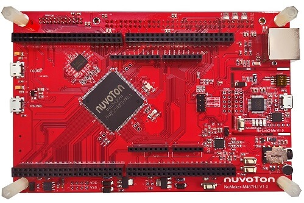

.. _fx500_02:

Fenix Auto FX500-02 board
########################

Overview
********

Features:
=========
- 32-bit Arm Cortex®-M23 M2354SJFAE MCU
- Core clock up to 96 MHz
- 1024 KB embedded Dual Bank Flash and 512 KB SRAM

More information about the board can be found at the `PFM M2354 User Manual`_.

Supported Features
==================

* The on-board 12-MHz crystal allows the device to run at its maximum operating speed of 96MHz.

The development board configuration supports the following hardware features:

+-----------+------------+-----------------------+
| Interface | Controller | Driver/Component      |
+===========+============+=======================+
| NVIC      | on-chip    | nested vectored       |
|           |            | interrupt controller  |
+-----------+------------+-----------------------+
| SYSTICK   | on-chip    | system clock          |
+-----------+------------+-----------------------+
| UART      | on-chip    | serial port           |
+-----------+------------+-----------------------+
| GPIO      | on-chip    | gpio                  |
+-----------+------------+-----------------------+

References
**********

.. _PFM M2354 User Manual:
   https://www.nuvoton.com/export/resource-files/UM_NuMaker-PFM-M467_User_Manual_EN_Rev1.01.pdf
.. _M2354 TRM:
   https://www.nuvoton.com/export/resource-files/TRM_M2354_Series_EN_Rev1.01.pdf
